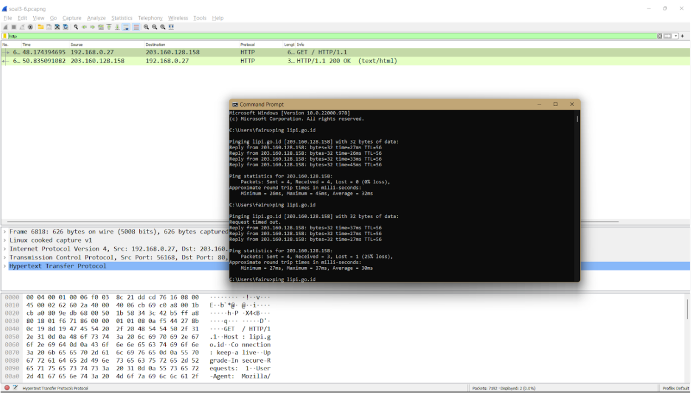

# :zap: **Jarkom-Modul-1-ITB01-2022** :zap:

| Nama                      | NRP            |
|---------------------------|----------------|
| Rafael Nixon              | 05311940000025 |
| Fairuz Azka Maulana       | 5027201017     |
| Muhammad Firdho Kustiawan | 5027201005     | 
<br/>


## :large_blue_circle: **Soal 1** :large_blue_circle: 
Sebutkan web server yang digunakan pada "monta.if.its.ac.id"!

**Jawaban:**
<br>
1. Pertama-tama kami memfilter paket yang ada dengan filter ```http.host eq “monta.if.its.ac.id```.
   
2. Kemudian memilih salah satu paket yang tersedia dan ```klik kanan -> Follow -> TCP Stream```.
   
3. Akhirnya didapatkan informasi web server yang digunakan.
   

## :large_blue_circle: **Soal 2** :large_blue_circle: 
Ishaq sedang bingung mencari topik ta untuk semester ini , lalu ia datang ke website monta dan menemukan detail topik pada website “monta.if.its.ac.id” , judul TA apa yang dibuka oleh ishaq ?

**Jawaban:**
<br>
1. Pertama-tama kami memfilter paket yang ada dengan filter ```http```.
   
2. Kemudian ```file``` menuju ```Export object -> HTTP```.
   
3. Kemudian save file yang bernama 194.
   
4. Kemudian buka file tersebut di local dengan format HTML, yang kemudian akan mendapatkan laman web yang dibuka oleh ishaq dan menemukan judul topik TA yang dilihat      ishaq.
   

## :large_blue_circle: **Soal 3** :large_blue_circle: 
Filter sehingga wireshark hanya menampilkan paket yang menuju port 80! 

**Jawaban:**
<br>
Kami memfilter paket yang tersedia dengan filter ```tcp.dstport == 80```


## :large_blue_circle: **Soal 4** :large_blue_circle:
Filter sehingga wireshark hanya mengambil paket yang berasal dari port 21!

**Jawaban:**
<br>
1. Untuk mencari paket yang berasal di port 21 kami menggunakan filter source port 21 pada protocol tcp dengan ```tcp.srcport == 21```
   

## :large_blue_circle: **Soal 5** :large_blue_circle: 
Filter sehingga wireshark hanya mengambil paket yang berasal dari port 443!

**Jawaban:**
<br>
1. Untuk mencari paket yang berasal di port 443 menggunakan filter source port 443 pada protocol tcp dengan ```tcp.srcport == 443```
   

## :large_blue_circle: **Soal 6** :large_blue_circle: 
Filter sehingga wireshark hanya menampilkan paket yang menuju ke lipi.go.id !

**Jawaban:**
<br>
Kami memfilter paketnya dengan dua cara:
1. Kami ping terlebih dahulu website lipi.go.id nya dan didapatkan alamat IP-nya. Kemudian kami filter paketnya dan didapatkan terdapat 1 paket yang memiliki IP yang sama dengan alamat IP yang telah dilakukan ping.
   
2. Kami tinggal memfilter paket-paket yang tersedia dengan filter ```http.host == lipi.go.id```
   

## :large_blue_circle: **Soal 7** :large_blue_circle: 
## :large_blue_circle: **Soal 8** :large_blue_circle: 

## :large_blue_circle: **Soal 9** :large_blue_circle: 
Terdapat laporan adanya pertukaran file yang dilakukan oleh kedua mahasiswa dalam percakapan yang diperoleh, carilah file yang dimaksud! Untuk memudahkan laporan kepada atasan, beri nama file yang ditemukan dengan format [nama_kelompok].des3 dan simpan output file dengan nama “flag.txt”.

**jawaban**
<br>
1. Dari jawaban soal no 8 kami mendapatkan clue untuk menemukan file yang dimaksud yakni merupakan file ```salted```
   

## :large_blue_circle: **Soal 10** :large_blue_circle: 
Temukan password rahasia (flag) dari organisasi bawah tanah yang disebutkan di atas!

**jawaban**
<br>
1. Dalam file salted pada jawaban no 9 kami berusaha untuk melakukan decrypt menggunakan kali linux dengan cara mendownload file tersebut dalam bentuk file dan kemudian kami pindah kan ke kali linux untuk dilakukan decrypt menggunakan openssl pada terminal kali linux dengan command sebagai berikut :```openssl des3 -d -in ITB01.des3```
   pada direktori yang sudah ada file salted tersebut 
   
   
## :large_blue_circle: **Kendala** :large_blue_circle:
1. Kami melakukan revisi pada soal no 10 kami kesulitan untuk melakukan decrypt pada file salted dikarenakan kami lupa untuk menyertakan -d pada command yang menyebabkan file tidak terdecrypt, mengakibatkan memberikan jawaban yang kurang akurat pada laporan.
